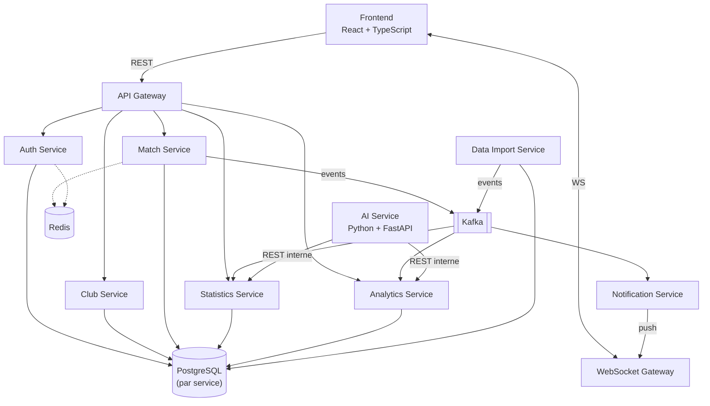

# C4 — Diagramme de conteneurs

## Vue cible (V5, indicative — ne pas construire d'un coup)



## Vue MVP (V1 — ce qu'on construit réellement, dans cet ordre)

```mermaid
flowchart TB
    fe["Frontend\nReact + TypeScript"]
    ing["Ingress\n(routage par chemin, tient lieu\nde gateway tant qu'il y a peu de services)"]
    auth["1. Auth Service\n(gabarit / fondation)"]
    club["2. Club Service"]
    match["3. Match Service\n(référence de complexité métier)"]
    pgA[("PostgreSQL\nschéma auth")]
    pgC[("PostgreSQL\nschéma club")]
    pgM[("PostgreSQL\nschéma match")]

    fe -->|REST /api/v1/*| ing
    ing --> auth & club & match
    club -.->|valide le JWT localement\n(pas d'appel réseau à Auth)| auth
    match -->|REST, lecture équipes/joueurs| club
    auth --> pgA
    club --> pgC
    match --> pgM
```

Chaque service est construit, dockerisé, testé et déployé avant d'attaquer le suivant. Un seul conteneur PostgreSQL héberge les 3 schémas au départ (économie de ressources VPS), sans jointure cross-service — uniquement des références par ID ou des appels REST explicites. Statistics, Analytics, Notification, Data Import et AI arrivent en V2+, une fois leur bounded context réellement justifié comme service indépendant (voir [`overview.md`](overview.md#ordre-de-construction-des-microservices)).
