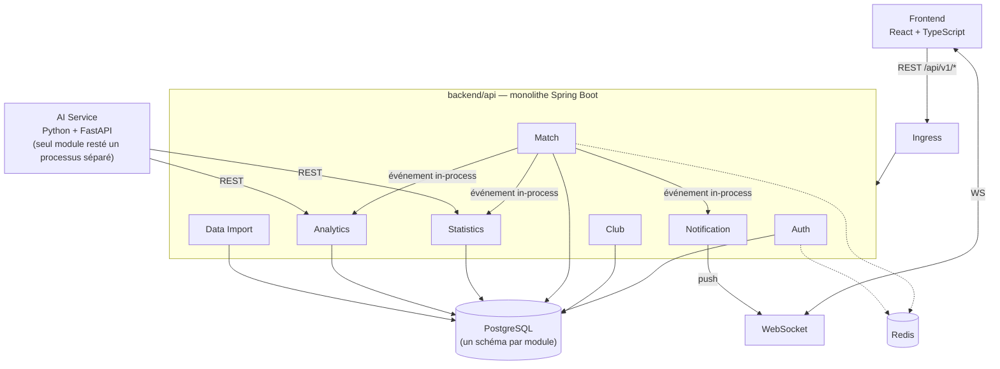
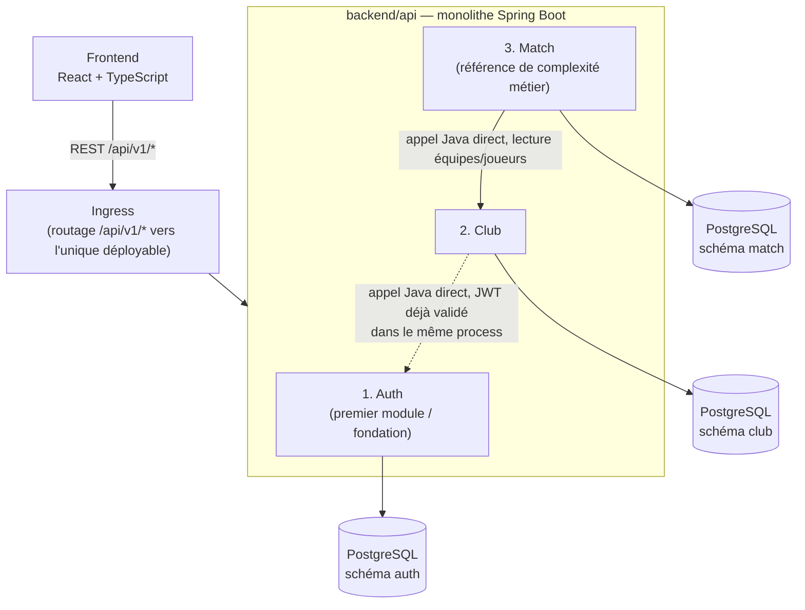

# C4 — Diagramme de conteneurs

> Depuis [ADR-017](../adr/ADR-017-monolithe-modulaire.md) (2026-08-14), l'architecture est un **monolithe modulaire** : un seul déployable Spring Boot (`backend/api`), les anciens "services" ci-dessous sont des **modules** (packages Java) à l'intérieur de ce déployable, pas des conteneurs séparés. Seul AI Service reste un processus externe (runtime Python différent).

## Vue cible (V5, indicative — ne pas construire d'un coup)

## Vue MVP (V1 — ce qu'on construit réellement, dans cet ordre)

Chaque module est construit et testé avant d'attaquer le suivant, mais tous partagent le même Dockerfile/pipeline CI/déploiement K8s (un seul déployable). Un seul conteneur PostgreSQL héberge les 3 schémas au départ (économie de ressources VPS), sans jointure cross-module — uniquement des références par ID ou des appels Java explicites. Statistics, Analytics, Notification, Data Import arrivent en V2+ comme nouveaux modules du même monolithe ; AI Service (V4) est la seule exception qui reste un service réseau séparé, runtime Python oblige (voir [`overview.md`](overview.md#ordre-de-construction-des-modules)).
