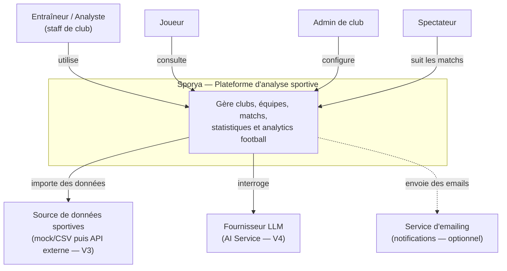

# C4 — Diagramme de contexte

Au MVP (V1), seuls les acteurs humains et Sporya existent : les systèmes externes (source de données, LLM, email) sont introduits progressivement (flèches en pointillés = pas encore construit). Voir [`overview.md`](overview.md) pour le détail des personas et [`containers.md`](containers.md) pour le niveau suivant.
